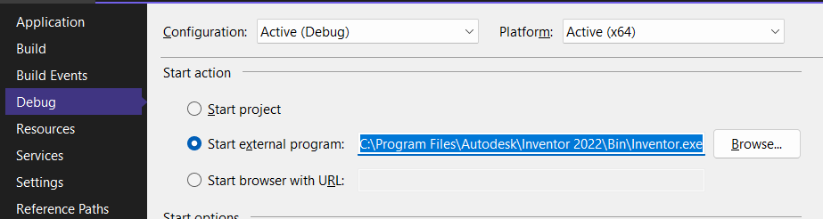

# Autodesk Inventor Addin Template for Microsoft VisualStudio

Project template for addin creation inside Autodesk Inventor (starting from Inventor 2018, but it works also for other lower version).

Zip all files inside TemplateAdskInventor.zip (without README ang .gitignore file) and put it inside C:\Users\info\Documents\Visual Studio [version]\Templates\ProjectTemplates

Build with Microsoft Visual Studio 2022.

## Before build

1 - rename Debug.Autodesk.[Project Name].Inventor to Autodesk.[Project Name].Inventor inside AddinManifest/Debug/
2 - update assembly path inside AddinManifest/Debug/Autodesk.[Project Name].Inventor

```xml
<Assembly>path to bin\x64\Debug\$safeprojectname$.dll</Assembly>
```

3 - set application for debug

  

## Autodesk Specific Information

How to register/unregister:

1) Build Project;

2) Copy add-in dll file to one of following locations: 
	a) Anywhere, then *.addin file <Assembly> setting should be updated to the full path including the dll name
	b) Inventor <InstallPath>\bin\ folder, then *.addin file <Assembly> setting should be the dll name only: <AddInName>.dll
	c) Inventor <InstallPath>\bin\XX folder, then *.addin file <Assembly> setting shoule be a relative path: XX\<AddInName>.dll

3) Copy.addin manifest file to one of following locations:
	a) Inventor Version Dependent
	Windows XP:
		C:\Documents and Settings\All Users\Application Data\Autodesk\Inventor [version]\Addins\
	Windows7/Vista:
		C:\ProgramData\Autodesk\Inventor [version]\Addins\

	b) Inventor Version Independent
	Windows XP:
		C:\Documents and Settings\All Users\Application Data\Autodesk\Inventor Addins\
	Windows7/Vista:
		C:\ProgramData\Autodesk\Inventor Addins\

	c) Per User Override
	Windows XP:
		C:\Documents and Settings\<user>\Application Data\Autodesk\Inventor [version]\Addins\
	Windows7/Vista:
		C:\Users\<user>\AppData\Roaming\Autodesk\Inventor [version]\Addins\

4) Startup Inventor, the AddIn should be loaded

To unregister the AddIn, remove the Autodesk.<AddInName>.Inventor.addin from above mentioned .addin manifest file locations directly.

ADDITIONAL INFORMATION
From [here](http://help.autodesk.com/view/INVNTOR/2018/ENU/?guid=GUID-52422162-1784-4E8F-B495-CDB7BE9987AB)

The contents of the .addin file are shown below. As you can see it uses xml to format the data.

```xml
<Addin Type="Standard">
    <!--Created for Autodesk Inventor Version 17.0--> 
    <ClassId>{51e6ad8e-5eaa-42a1-b845-a68802a26bf7}</ClassId>
    <ClientId>{51e6ad8e-5eaa-42a1-b845-a68802a26bf7}</ClientId>
    <DisplayName>SampleAddIn</DisplayName>
    <Description>SampleAddIn</Description> 
    <Assembly>SampleAddIn.dll</Assembly>
    <OSType>Win64</OSType>
    <LoadAutomatically>1</LoadAutomatically> 
    <UserUnloadable>1</UserUnloadable>
    <Hidden>0</Hidden> 
    <SupportedSoftwareVersionGreaterThan>16..</SupportedSoftwareVersionGreaterThan>
    <DataVersion>1</DataVersion> 
    <LoadBehavior>2</LoadBehavior> 
    <UserInterfaceVersion>1</UserInterfaceVersion>
</Addin> 
```

The following describes the different elements of the .addin file:

Addin - (Required) The outermost element to involve all other elements. The Type attribute specifies the addin type, valid values are "Standard" and "Translator".

ClassId - (Required) Specifies the ClassId GUID associated with an Add-in. This may or may not change from one release to the next. If you look at your add-in code you'll see this specified as a GuidAttribute for your add-in class. In almost all cases you don't need to do anything with this but use what is provided.

ClientId - (Required) Specifies a GUID that is used as the add-in identifier. This value should remain unchanged across releases and different versions of the add-in. This value is used to identify the owner of API-created objects such as ribbons, toolbars, etc. In almost all cases this will be the same as the ClassId.

DisplayName - (Required) Specifies the display name of the add-in as it will appear in the Add-in manager. The Language attribute can be specified for local languages, if not specified it defaults to English, below example sets the DisplayName for French:

<DisplayName Language="1036">Convertisseur: DWF</DisplayName>
Description - (Required) This is a description of your add-in and is displayed in the bottom of the Add-In Manager dialog when the add-in is selected from the list. The Language attribute can be specified for local languages, if not specified it defaults to English, below example sets the Description for French:

<Description Language="1036">Convertisseur Autodesk interne DWF</Description>
Assembly - This is the path to you add-ins dll. This can be a full path or a relative path where it's relative to the location of your .addin file. It can also be relative to the Inventor\bin directory however since you're not allowed to install into that directory with Administrator privileges it's not recommended that you use that directory. A path relative to the location of the .addin file is recommended and is discussed in more detail below.

OSType - (Optional) Specifies if your add-in will work with only a 64 or 32 bit operating system. Valid values for this are "Win32" or "Win64". If this value is not specified it's assumed the add-in is assumed to be valid for both.

LoadAutomatically - (Optional) Specifies whether the add-in should be allowed to load automatically as per the load behaviors defined by the add-in. Value can be 0 or 1. Assumed to be true (1) if this value is not specified. If set to false (0), the add-in needs to be manually loaded using the add-in manager.

LoadBehavior - (Optional) Specifies when the add-in should be loaded in Inventor. This is important for better startup performance. This option can be specified using one of the following values:
0 - Load immediately on startup (not recommended)
1 - Load when any document is opened
1 - Load when a part document is opened (same as previous)
2 - Load when an assembly document is opened
3 - Load when a presentation document is opened
4 - Load when a drawing document is opened
10 - Load only on demand, either through the API or using the Add-In Manager.

Assumed to be 0 if this value is not specified.
UserUnloadable - (Optional) Specifies whether the add-in should be allowed to load automatically as per the load behaviors defined by the add-in. Value can be 0 or 1. Assumed to be true (1) if this value is not specified. If set to false (0), the add-in needs to be manually loaded using the add-in manager.

Hidden - (Optional) Specifies whether the add-in should be hidden in the Add-in Manager�s list of add-ins. Assumed to be false if this value is not specified (i.e. add-in is visible). Value can be 0 or 1.

SupportedSoftwareVersionEqualTo
SupportedSoftwareVersionGreaterThan
SupportedSoftwareVersionLessThan
SupportedSoftwareVersionNotEqualTo - (Optional) Specifies the version(s) of Inventor that the add-in should be available in. Combinations of these can be used. These values are ignored if the manifest file is located in a version-specific folder.Versions are declared in the format of Major#.Minor#.ServicePack# / or BuildIdentifier#. SupportedSoftwareVersionEqualTo and SupportedSoftwareVersionNotEqualTo support multiple version entries seperated by a semicolon (;).

DataVersion - (Optional) Specifies the version of add-in data contained within Inventor documents that this version of the add-in supports. This is used by add-ins that store migrating data in Inventor documents, which is indicated by the "DocumentInterests" set on the document.

UserInterfaceVersion - (Optional) Specifies the version of the add-in's user interface. Changing this version results in all of the add-in's UI getting cleaned up during Inventor start-up.

Below elements are specifically for translator add-ins.

FileExtensions - (Optional) Specifies the file extensions of the translator add-in can import from or export to. If multiple file extensions are specified the delimiter semicolon can be used between them. Below is sample to specify the FileExtensions:

<FileExtensions>.CATPart;*.CATProduct;*.cgr</FileExtensions>
FilterText - (Optional) Specifies the filter text for a translator add-in. The Language attribute can be specified for local languages, if not specified it defaults to English, below example sets the FilterText for French:

<FilterText Language="1036">Fichiers CATIA V5 (*.CATPart;*.CATProduct;*.cgr)</FilterText>
SupportsSaveCopyAs - (Optional) Specifies whether the translator add-in supports the Save Copy As. Value can be 0 or 1. Assumed to be false (0) if this value is not specified. If set to true (1), the FilterText will be availabe in the Save Copy As dialog.

SupportsSaveCopyAsFrom - (Optional) Specifies which documents the translator add-in supports to export. Valid values are the Inventor documents extensions with semicolon as delimiter. Below is sample to specify the SupportsSaveCopyAsFrom:

<SupportsSaveCopyAsFrom>.ipt;.iam</SupportsSaveCopyAsFrom>
SupportsOpen - (Optional) Specifies whether the translator add-in supports to open a foreign data. Value can be 0 or 1. Assumed to be false (0) if this value is not specified.

SupportsOpenInto - (Optional) Specifies which documents the translator add-in supports to open into. Valid values are the Inventor documents extensions with semicolon as delimiter. Below is sample to specify the SupportsOpenInto:

<SupportsOpenInto>.ipt;.iam</SupportsOpenInto>
SupportsImport - (Optional) Specifies whether the translator add-in supports importing data. Value can be 0 or 1. Assumed to be false (0) if this value is not specified. If set to true (1), the FilterText will be availabe in the Open dialog.

SupportsImportInto - (Optional) Specifies which documents the translator add-in supports to import into. Valid values are the Inventor documents extensions with semicolon as delimiter. Below is sample to specify the SupportsImportInto:

<SupportsImportInto>.ipt;.iam</SupportsImportInto>

## Reference

[Template parameters](https://learn.microsoft.com/en-us/visualstudio/ide/template-parameters?view=vs-2022)  
[How to: Substitute parameters in a template](https://learn.microsoft.com/en-us/visualstudio/ide/how-to-substitute-parameters-in-a-template?view=vs-2022)  
[How to: Create project templates](https://learn.microsoft.com/en-us/visualstudio/ide/how-to-create-project-templates?view=vs-2022)  
[Custom Project Templates in Visual Studio 2019](https://www.youtube.com/watch?v=DLLsmb7En_8)  
